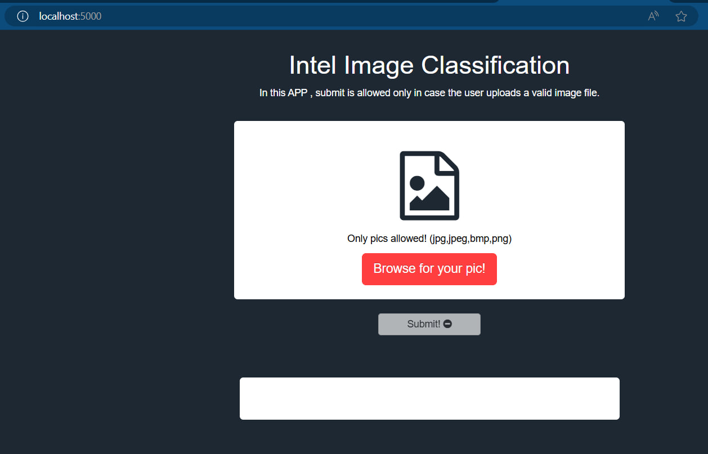
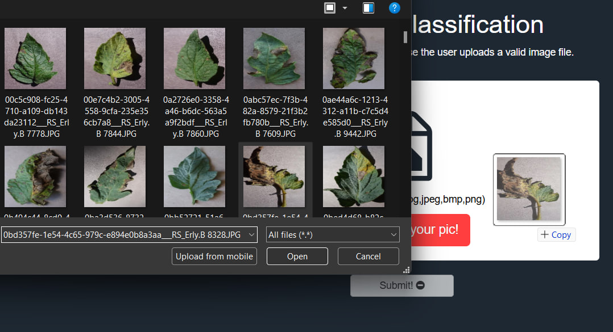
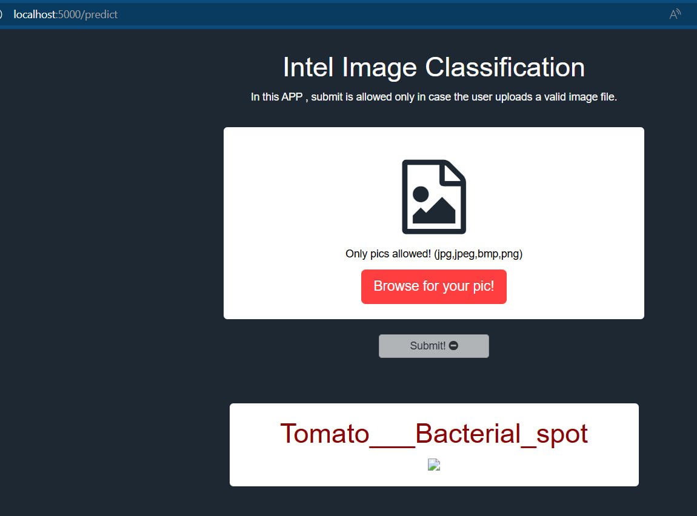

# Tomatoes Disease Classification Mobile Project
This project core focuses on identifying different tomato plant diseases, thus assessing farmers and anyone interested in tomatoes to correclty classify the disease of tomato plant
## Table of Contents 

* [What is this project](https://github.com/Abdelrahman-ammar/Tomatoes-Mobile-Classification/blob/main/README.md#What-is-this-project)

* [Details](https://github.com/Abdelrahman-ammar/Tomatoes-Mobile-Classification/blob/main/README.md#Details)

* [Project Structure](https://github.com/Abdelrahman-ammar/Tomatoes-Mobile-Classification/blob/main/README.md#Project-Structure)

* [How to Start](https://github.com/Abdelrahman-ammar/Tomatoes-Mobile-Classification/blob/main/README.md#How-to-Start)

* [Model Deployment - Docker](https://github.com/Abdelrahman-ammar/Tomatoes-Mobile-Classification/blob/main/README.md#Model-Deployment-Docker)

* [Model Deployment - Heroku](https://github.com/Abdelrahman-ammar/Tomatoes-Mobile-Classification/blob/main/README.md#Model-Deployment-Heroku)

* [Demo](https://github.com/Abdelrahman-ammar/Tomatoes-Mobile-Classification/blob/main/README.md#Demo)

### What is this Project
As in the description above this project identifies the tomato diseases between 10 different diseases of the tomato (including the Healthy or the normal class)

## Details
This project involved the basic pipeline stpes for any Deeplearning model starting from the data gathering until Deployment , Using a CNN model and Data Augmentation techniques i was able to get accuracy of 95% and loss of 0.17,    

<B>Since this project should be inetgrated with a mobile application so it would be a good choice to have an api for the model prediction directly , and this was done using 2 methods (Heroku and Docker) which we will be going through the steps of each of them. </B>

## Project Structure 
- [Training Notebook](./training.ipynb/) : Reading , Preprocessing Data and Model training & Evaluation 
- [Flask App](./app.py) : Deployment using Flask 

- [Libraries Used](./requirements.txt) : Python Libraries 

- [GUI](./templates) : The templates and static folders that contains files required for GUI

- [Docker Flile](./Dockerfile) : File which contains instructions for building the container
## How to start
---
1. **Cloning the repo** : git clone this repo
2. **Install requirement.txt file** : 
`pip install -r requirements.txt`
3. **Run app.py** :  `python app.py`

 

# Model Deployment - Docker:
---
1. A `Dockerfile` is provided which can be used for deployment. From this `Dockerfile` a docker image can be created and deployed in cloud, etc.

2. Then, open a command line cmd at the root of the repository, and run the command: `docker build -t tomato_classifier:v1.0 .`
            
    ( Once the image is created, you can push the docker image to the docker hub in your repo)

3. To run the docker image, open the cmd at the root of the repo and run the command:
`docker run -d -p 5000:5000 tomato_classifier:v1.0`
with the -d in the command it means running in the detached mode , you can always interact with the container using `-it` in the command instead of `-d`

4. Open the link on your preffered browser: `http://127.0.0.1:5000/`, or check the logs provided by Docker in command line, to find the link.

Also a seperate `templates/index.html` and `app.py` is provided which can serve as frontend and backend for a web app , the endpoint which will be integrated is `predict`

# Model Deployment - Heroku:
---
Heroku has some similarities like github commands and it has its own cli from which the heroku commands will be written

To use Heroku you should have some files:

1. **Procfile** : which should contain the command that heroku will run , in our case it is a web command

2. **runtime.txt file** :Since we are wokring with python and the deployment should be also with python so you should tell Heroku what python version you are using to run the app

3. **wsgi.py** : This file is not a mandatory , it just imports the app from the `app.py` file , but notice that you should write the name of the file that would be running (app.py) in the Procfile , in our case I put the wsgi.py file as the startup file

# Demo
---

# Final Notes:
---
You can find the dataset on which the model was trained on here :
(https://www.kaggle.com/datasets/kaustubhb999/tomatoleaf)

Also you can pull the image of the docker file from my registry on docker hub: (https://hub.docker.com/r/abdelrahman36/tomato_classifier/tags)
# Congratulations 🥳🎉
---
<B>You've successfully run and deployed the project</B>.